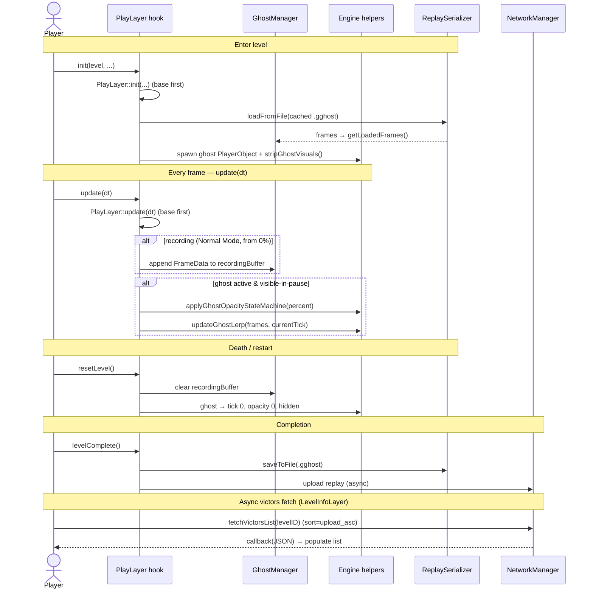

<!--
  GHOST VICTORS — PHASE IMPLEMENTATION PLAN (TEMPLATE)
  ====================================================
  Copy this file to  docs/plans/phase{N}-{slug}.plan.md  and fill every section.
    e.g.  docs/plans/phase1-recording.plan.md

  Purpose: a house-style record of ONE roadmap phase — what it delivers, which module owns which
  logic, and exactly which files were created — so the implementation stays legible months later.
  Write the SPEC half first (§1 acceptance criteria → §2 scope → §3 functional requirements), get it
  reviewed, THEN fill the TECHNICAL half and start coding.

  Stack: Geode SDK · C++23 · CMake · Cocos2d-x · Geometry Dash 2.2081

  ID vocabulary (source of truth = docs/SRS.md + docs/SDS.md):
    FR-*     Functional Requirement        (SRS §3)
    AC-*     Acceptance Criterion          (SRS §4 matrix)
    NFR-*    Non-Functional Requirement    (SRS §5)
    Hooks    Hook → responsibility map     (SRS §6)
    SDS §    Design section reference      (SDS.md)
    Phase N  Roadmap phase                 (CLAUDE.md §7)

  Delete every <!-- guidance --> comment as you fill the section in.
-->

# Phase {N}: {Phase title}

> **FR:** {FR-x, FR-y} · **AC:** {AC-nn, AC-mm} · **NFR:** {NFR-n} · **Hooks:** {PlayLayer::update, …} · **SDS:** {§3.2, §2} · **Status:** {ready-for-dev | in-progress | done — build + in-game green} · **Branch:** `{branch}` · **Commit:** `{shorthash}`
> **Source specs:** `docs/SRS.md` · `docs/SDS.md` · **Roadmap:** `CLAUDE.md#7-implementation-roadmap`

<!-- guidance: one sentence — what this phase delivers and why it matters. -->

**This phase delivers** {outcome}.

---

## 1. Spec — Acceptance criteria

<!-- guidance: copy ONLY the AC rows (SRS §4) this phase must satisfy. These define "done". -->

| AC ID | Procedure | Expected outcome |
|-------|-----------|------------------|
| AC-{nn} | {how to test in-game} | {observable pass condition} |
| AC-{mm} | {…} | {…} |

---

## 2. Spec — What we will build

<!-- guidance: 1–2 sentences of scope, then an explicit out-of-scope list so the phase stays bounded. -->

**In scope:** {what this phase implements}.

**Out of scope (later phases):** {deferred items → which phase}.

---

## 3. Spec — Functional & non-functional requirements

<!-- guidance: the FR / NFR rows (SRS §3 / §5) this phase implements. One row each. -->

| ID | Requirement | Notes |
|----|-------------|-------|
| FR-{x} | {requirement text} | {constraint / value} |
| NFR-{n} | {perf / storage / latency budget} | {target} |

---

## 4. Gaps & Decisions (Resolved)

<!-- guidance: design-time questions settled before/during build. Area = Rendering | Storage | Network | Perf | Scope. -->

| ID | Area | Decision | Status |
|----|------|----------|--------|
| D1 | {area} | {what was decided and why} | ✅ Resolved |
| D2 | {area} | {…} | ✅ Resolved |

---

## 5. Technical plan — Source-tree layout

<!-- guidance: every src/ file this phase touches, grouped by module, with (new)/(mod) + one-line role.
     CMakeLists.txt GLOB_RECURSEs src/*.cpp, so new .cpp/.hpp need NO build edits. Mirrors CLAUDE.md §6. -->

```text
src/
├── DataTypes.hpp                 # (new/mod) {packed ReplayHeader / FrameData changes}
├── GhostManager.hpp              # (new/mod) {singleton state this phase adds}
├── {Helper}.hpp                  # (new) {engine helper — key function}
├── ReplaySerializer.hpp          # (new/mod) {.gghost IO}
├── NetworkManager.hpp            # (new/mod) {async HTTP / cache}
└── hooks/
    ├── PlayLayerHook.cpp         # (new/mod) {which overrides}
    ├── LevelInfoLayerHook.cpp    # (new/mod) {UI / API query}
    └── PauseLayerHook.cpp        # (new/mod) {toggle}
```

---

## 6. Technical plan — Module responsibilities

<!-- guidance: who owns which logic for THIS phase. The Geode analogue of a thin-hook / engine split. -->

| Layer | Owns (for this phase) | File(s) |
|-------|-----------------------|---------|
| Hook override (`$modify`) | call base impl, then delegate; no heavy logic inline | `src/hooks/{Hook}.cpp` |
| Manager singleton | shared state: active victor, frames, recording buffer, pause flag | `src/GhostManager.hpp` |
| Engine helper | stripping / opacity / lerp — pure, header-only | `src/{Helper}.hpp` |
| Serializer | `.gghost` binary read/write + magic verify | `src/ReplaySerializer.hpp` |
| Network / cache | async `web::WebRequest`, download to local cache | `src/NetworkManager.hpp` |

---

## 7. Technical plan — Data & format

<!-- guidance: the .gghost layout or in-memory buffers this phase touches. Omit if none. Keep packed. -->

| Struct / buffer | Size / layout | Notes |
|-----------------|---------------|-------|
| `ReplayHeader` | 68 B, `#pragma pack(push,1)`, magic `GGST` | {fields used/added; bump `formatVersion` on layout change} |
| `FrameData` | 17 B (`tick` u32, `x`/`y`/`rot` f32, `gameMode` u8) | {which fields captured this phase} |
| `m_recordingBuffer` | `std::vector<FrameData>` | {when appended / cleared} |

---

## 8. Technical plan — Rules & invariants

<!-- guidance: each enforceable rule → its source ID → the exact file/function that enforces it. -->

| Rule | Source | Enforced in |
|------|--------|-------------|
| {opacity: 0/3/5% thresholds → 0…128} | SRS FR-1.2…1.4 / SDS §3.2 | `src/OpacityStateMachine.hpp` |
| {icon-only: strip trails + particle emitters} | SRS FR-3.2 / SDS §3.1 | `src/GhostStripper.hpp` |
| {record only Normal Mode from 0%} | SRS FR-2.1 | `src/hooks/PlayLayerHook.cpp::update` |
| {verify `GGST` magic on load} | SDS §2.1 | `src/ReplaySerializer.hpp::loadFromFile` |
| {victors sorted upload-ascending} | SRS FR-4.2 | `src/NetworkManager.hpp` |
| {ghost resets to tick 0 with player} | SRS FR-1.5 / AC-06 | `src/hooks/PlayLayerHook.cpp::resetLevel` |
| {ghost update < 2% CPU/tick} | SRS NFR-1 | `src/hooks/PlayLayerHook.cpp::update` |

---

## 9. Per-tick / lifecycle flow

<!-- guidance: fit the diagram to the GD frame loop and the async fetch path. Keep only the participants
     this phase actually uses; alt-branch the record vs. playback paths inside update(). -->



---

## 10. Convention compliance (CLAUDE.md §4 / §5)

<!-- guidance: the conventions this phase must honor + how. Keep to the relevant ones. -->

| Rule | Status | Note |
|------|--------|------|
| `$modify` calls base impl first, short-circuits on failure | Required | {…} |
| Per-instance state lives in the `Fields` struct, not free members | Required | {…} |
| Ghost renders icon-only (all trails/particles stripped) | Required | {…} |
| Ghost added to `m_objectLayer` behind the player | Required | {…} |
| Meets NFR budgets (< 2% CPU/tick · ≤ 250 KB/2 min · < 10 ms load) | Required | {…} |

---

## 11. Tasks (checklist)

<!-- guidance: the pre-implementation checklist — review BEFORE coding. Check off as done. -->

| ID | Task | File |
|----|------|------|
| T01 | {…} | `src/{…}` |
| T02 | {…} | `src/{…}` |
| T03 | {…} | `src/hooks/{…}.cpp` |

- [ ] T01 [ ] T02 [ ] T03

---

## 12. Definition of Done (gate)

<!-- guidance: the phase is DONE only when every box below is ticked. The universal gate is fixed;
     derive the phase-specific boxes from your §1 AC-IDs + concrete observable checks (one box each).
     Record the evidence for each in §13 Verification. -->

**Universal gate — every phase:**

- [ ] `geode build` succeeds (CMake ≥ 3.21 · C++23 · `GEODE_SDK` set), no errors.
- [ ] Mod loads in GD `2.2081`; no crash on menu / level entry / exit.
- [ ] No regression — base game plays normally with the mod active.
- [ ] Compile-time layout check passes: `static_assert(sizeof(ReplayHeader)==68)` and
      `static_assert(sizeof(FrameData)==17)` (in `DataTypes.hpp`).
- [ ] All §11 tasks ticked and the §14 File List filled in.
- [ ] Relevant NFR budgets met (NFR-1 < 2% CPU/tick · NFR-2 ≤ 250 KB / 2 min · NFR-3 < 10 ms load).

**Phase-specific — must pass in-game:**

<!-- guidance: one checkbox per AC-ID / concrete check this phase owns, e.g.
     - [ ] AC-02 — ghost invisible 0–3% (observed in level). -->

- [ ] {AC-nn} — {observable pass condition}
- [ ] {AC-mm} — {observable pass condition}
- [ ] {non-AC check, e.g. `.gghost` ≤ 250 KB for a 2-min run}

---

## 13. Verification

<!-- guidance: this project's real gates + in-game runtime. Record what actually passed. -->

- **Build:** `geode build` green (CMake ≥ 3.21 · C++23 · `GEODE_SDK` env set). `<result>`
- **In-game runtime** (GD 2.2081): walk each listed AC-ID and record the outcome. `<result>`
- **NFR checks** (if touched): recording size vs. 250 KB / load time / frame stability. `<result>`
- **Note:** there is no automated test harness — verification is manual/in-game (the struct
  `static_assert`s in §12 are the only automated check).

---

## 14. Dev Agent Record — File List

<!-- guidance: the post-implementation inventory — "what we actually built/changed". -->

| File | Created / Modified | Role |
|------|--------------------|------|
| `src/{path}` | Created | {one-line role} |
| `src/{path}` | Modified | {what changed} |

**Not in scope (later phases):** {deferred items → which phase}.
