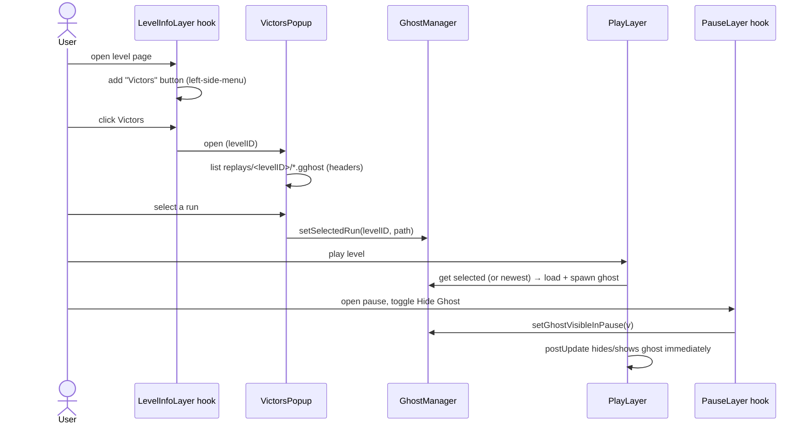

# Phase 3: UI

> **FR:** FR-4.1 (local), FR-1 (pause visibility) · **AC:** AC-08 (+P3-AC1…5) · **NFR:** NFR-3 · **Hooks:** `LevelInfoLayer::init`, `PauseLayer::customSetup` (+ `PlayLayer` load/postUpdate tweaks) · **SDS:** §1, §6 · **Status:** in-progress · **Spec:** `docs/plans/phase3-ui.spec.md` · **Roadmap:** `CLAUDE.md#8-implementation-roadmap`

**Delivers** a "Victors" button + popup to pick which local run to race, keep-multiple recordings, and a
pause-menu hide/show toggle (AC-08).

> UI bindings provided by the user (web search is policy-disabled — see the `no-web-search` memory).
> Confirmed: `getChildByID("left-side-menu")` / `"center-button-menu"` (geode.node-ids); `CircleButtonSprite`
> + `CCMenuItemSpriteExtra`; `geode::Popup<...>` + `ScrollLayer`/`ColumnLayout`; `CCMenuItemToggler`;
> `file::readDirectory`. Call the base impl before `getChildByID`; `menu->updateLayout()` after adding.

## 1. Acceptance criteria
AC-08 pause toggle hides/shows immediately · P3-AC1 button appears · P3-AC2 popup lists this level's
runs · P3-AC3 pick → that ghost races · P3-AC4 multiple runs kept · P3-AC5 empty state, no error.

## 2. What we build
Keep-multiple recording + Victors button/popup + selection in `GhostManager` + selection-aware load +
pause toggle (with active hide).

## 3. FR / NFR
FR-4.1 (local victors entry) · pause-visibility respected + immediate hide · NFR-3 popup builds fast.

## 4. Gaps & Decisions (Resolved)

| ID | Area | Decision |
|----|------|----------|
| DP14 | Storage | Keep every run: `getSaveDir()/replays/<levelID>/<timestamp>.gghost` (supersedes DP3 overwrite). Timestamp via `std::chrono` epoch seconds. `ReplaySerializer::saveToFile` already makes parent dirs. |
| DP15 | UI | Victors popup lists **local** runs for this level (victor name + length). No upload-order (Phase 4). |
| DP16 | State | `GhostManager` gains a **selected-run** field (levelID + path). Set by the popup; `PlayLayer` load uses it when the level matches, else defaults to the **most recent** run in the level folder. |
| DP17 | Playback | Pause toggle actively **hides** the ghost when off (else-branch in `postUpdate`), not just skips driving it. |
| DP18 | Org | New `src/hooks/LevelInfoLayerHook.cpp`, `src/hooks/PauseLayerHook.cpp`, `src/VictorsPopup.hpp`; move the `LevelInfoLayer` stub out of `main.cpp`. PlayLayer stays in `main.cpp`. |

## 5. Source-tree layout

```text
src/
├── main.cpp                 # (mod) PlayLayer: selection-aware ghostLoadAndSpawn; DP17 active-hide; LevelInfoLayer stub removed
├── GhostManager.hpp         # (mod) selected-run field + setter/getter/clear
├── VictorsPopup.hpp         # (new) geode::Popup — lists local runs, select → GhostManager
├── ReplaySerializer.hpp     # (reused) loadFromFile (read headers for the list)
└── hooks/
    ├── LevelInfoLayerHook.cpp   # (new) "Victors" button → VictorsPopup
    └── PauseLayerHook.cpp       # (new) hide/show toggle → GhostManager
```

## 6. Module responsibilities
- `LevelInfoLayerHook` — inject button, open popup.
- `VictorsPopup` — enumerate `replays/<levelID>/*.gghost`, read each header (victor + `totalFrames`→sec),
  build rows (name · length · Select); "None" row to disable; on select → `GhostManager::setSelectedRun`.
- `PauseLayerHook` — toggler reflecting/flipping `GhostManager::isGhostVisibleInPause`.
- `GhostManager` — holds selected run + pause-visibility (already has the flag).
- `PlayLayer` (main.cpp) — load selected/most-recent; hide ghost when pause-visibility off.

## 7. Data / behavior detail
- **Save (levelComplete):** `path = saveDir/"replays"/<levelID>/fmt::format("{}.gghost", epochSeconds)`.
- **List (popup):** `file::readDirectory(saveDir/"replays"/<levelID>)`; filter `.gghost`; for each,
  `ReplaySerializer::loadFromFile` → row text `"{victorName} · {frames/60}s"`.
- **Select:** `GhostManager::setSelectedRun(levelID, path)`; popup closes.
- **Load (`ghostLoadAndSpawn`):** if `GhostManager` has a selection for this levelID → load it; else pick
  the **newest** file in the folder; else no ghost (P3-AC5). Replaces the fixed `<levelID>.gghost` path.
- **Pause toggle:** on click → `bool v = !isGhostVisibleInPause(); setGhostVisibleInPause(v);` toggler
  visual follows `v` (source of truth = GhostManager, avoids `isToggled()` ambiguity ⚠).
- **postUpdate (DP17):** `if (active && ghost) { if (!isGhostVisibleInPause()) ghost->setVisible(false); else { …drive… } }`.

## 8. Rules & invariants
Base impl called first before `getChildByID` (node-ids timing) · `menu->updateLayout()` after adding ·
custom IDs suffixed `"_spr"` · popup via `geode::Popup` (auto touch priority) · keep-multiple never
overwrites · selection is per-level.

## 9. Flow



## 10. Convention compliance
`$modify` base-first ✅ · header-only `VictorsPopup.hpp` + engine headers ✅ · per-instance state in
Fields (unchanged) ✅ · node-ids + updateLayout ✅ · GLOB picks up new `.cpp` (no CMake edit) ✅.

## 11. Tasks
| ID | Task | File |
|----|------|------|
| T01 | Keep-multiple save path `replays/<levelID>/<ts>.gghost` | `main.cpp` (levelComplete) |
| T02 | `GhostManager` selected-run field + API | `GhostManager.hpp` |
| T03 | Selection-aware / newest-fallback load | `main.cpp` (ghostLoadAndSpawn) |
| T04 | DP17 active-hide in postUpdate | `main.cpp` |
| T05 | `VictorsPopup` (list + select + None + empty state) | `VictorsPopup.hpp` |
| T06 | "Victors" button in LevelInfoLayer → popup | `hooks/LevelInfoLayerHook.cpp` (move stub) |
| T07 | Pause hide/show toggle → GhostManager | `hooks/PauseLayerHook.cpp` |
| T08 | `geode build` green | — |

- [x] T01 [x] T02 [x] T03 [x] T04 [x] T05 [x] T06 [x] T07 [ ] T08 *(build pending — run `geode build` on your machine)*

## 12. Definition of Done (gate)
**Universal:** build green · loads, no crash · no regression · struct `static_assert`s pass · §11 ticked
+ §14 filled · NFR met.
**Phase-specific:** AC-08 · P3-AC1 (button) · P3-AC2 (this-level list) · P3-AC3 (pick races) ·
P3-AC4 (multiple kept) · P3-AC5 (empty state, no error).

## 13. Verification
- `geode build` green (user machine). `<result: pending>`
- Record 2 runs on a level → both kept; Victors button opens popup listing both (name+length); pick one
  → it races; pick another → changes; pause → Hide Ghost vanishes it immediately; fresh level → empty
  popup, no ghost, no error. `<result: pending>`

## 14. Dev Agent Record — File List
| File | C/M | Role |
|------|-----|------|
| `src/hooks/LevelInfoLayerHook.cpp` | Created | Victors button |
| `src/hooks/PauseLayerHook.cpp` | Created | pause hide/show toggle |
| `src/VictorsPopup.hpp` | Created | local runs picker popup |
| `src/GhostManager.hpp` | Modified | selected-run state |
| `src/main.cpp` | Modified | keep-multiple save, selection load, active-hide, stub removed |

**Not in scope:** networked upload-ordered list + offline cache (Phase 4), replay/spectate (Phase 5).
