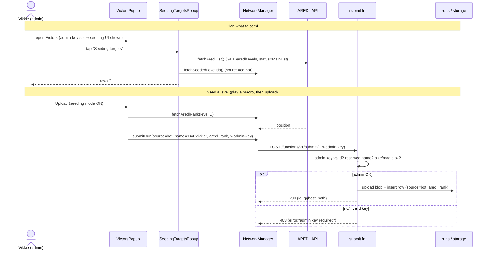

# Phase 6: Seeding ("Bot Vikkie")

> **FR:** FR-4.x (extends) · **AC:** P6-AC1…6 · **Spec:** `docs/plans/phase6-seeding.spec.md` ·
> **Design:** `docs/plans/victors-platform.design.md` §5 · **Status:** in-progress (code done; awaiting build + in-game/server verify) · **Depends on:** P4a/P4b
> **Source specs:** `docs/SRS.md` · `docs/SDS.md` · **Roadmap:** `CLAUDE.md#8-implementation-roadmap`

**This phase delivers** an admin-only seeding path — Normal-mode macro runs upload as `source=bot` /
`victor_name="Bot Vikkie"` (server-verified by a private admin key), plus an AREDL-driven
Seeding-targets view showing which main-list demons still need a ghost, stamping `aredl_rank` on seeds.

---

## 1. Spec — Acceptance criteria

| AC ID | Procedure | Expected outcome |
|-------|-----------|------------------|
| P6-AC1 | Seeding mode ON **with a valid admin key**, Upload a run. | Stored as `source=bot`, `victor_name="Bot Vikkie"`; BOT badge online. |
| P6-AC2 | Bot upload **without** a valid admin key. | Server **rejects** the bot label (403) — no fake official seeds. |
| P6-AC3 | Play a Normal-mode **macro** 0→100%. | Records a `.gghost` (existing engine, no gate change) → uploadable as a bot seed. |
| P6-AC4 | Open the **Seeding targets** view. | Lists AREDL main-list demons (`legacy:false`) with a seeded/unseeded mark. |
| P6-AC5 | Upload a seed for an AREDL level. | `aredl_rank` (= AREDL `position`) stored on the row. |
| P6-AC6 | Normal player (empty admin key). | No behavior change; **seeding UI never renders**; can't post bot seeds. |

---

## 2. Spec — What we will build

**In scope:** `mod.json` settings (`seeding-mode`, `admin-key`); admin-gated bot upload wiring; `submit`
admin check + `aredl_rank` + reserved name; AREDL client fetch; Seeding-targets popup; UI-visibility gate.

**Out of scope (later phases):** legit verification/filter + identity proof (P7), practice/StartPos
capture, AREDL server-side caching (P7+), spectate (P5).

---

## 3. Spec — Functional & non-functional requirements

| ID | Requirement | Notes |
|----|-------------|-------|
| FR-4.x (ext) | Upload/list gains an admin-gated `bot` source + `aredl_rank` metadata | anon key public; admin key server-verified |
| NFR (net) | AREDL + seeded fetch non-blocking | worker thread + `queueInMainThread` (P4b pattern) |
| NFR (perf) | No new gameplay per-tick cost | seeding is UI/network only |

---

## 4. Gaps & Decisions (Resolved)

| ID | Area | Decision | Status |
|----|------|----------|--------|
| D1 | Security | Admin gate **server-enforced**: `submit` compares the `x-admin-key` header to the `ADMIN_KEY` secret. Bot label / reserved name **without** a valid key → **403** (no silent human downgrade). | ✅ Resolved |
| D2 | UI | Seeding UI (bot-upload behavior + Seeding-targets button) rendered **only when `admin-key` is non-empty**. UX gate, not security. | ✅ Resolved |
| D3 | Network | `aredl_rank` looked up per-upload via **single-level** `GET /v2/api/aredl/levels/{level_id}` → `position`; omit the param if the level isn't on AREDL. | ✅ Resolved |
| D4 | Network | **Seeded = a `runs` row with `source=bot` exists** for that `level_id`. One query: `runs?source=eq.bot&select=level_id`, cross-ref the AREDL list. | ✅ Resolved |
| D5 | Scope | AREDL list = `GET /v2/api/aredl/levels` (array); **main list = `status == "MainList"`** (no `legacy` field); `aredl_rank` = AREDL `position` (1 = hardest); `level_id` = GD level id. | ✅ Resolved |
| D6 | Scope | Bot uploads reuse the **existing recording engine** (Normal-mode macro) — no recording-gate change. | ✅ Resolved |
| D7 | Security | Name **"Bot Vikkie" reserved** server-side (case-insensitive) — non-admin uploads using it → 403. | ✅ Resolved |
| D8 | UI | Seeding-targets entry point = a button **in the Victors popup** (admin-only). | ✅ Resolved |
| D9 | Security | GD-account identity proof **NOT** added in P6 (name is display-only today). Deferred to P7 (evaluate Argon; never send raw GJP2). | ✅ Resolved |

---

## 5. Technical plan — Source-tree layout

```text
mod.json                              # (mod) + seeding-mode (bool, off) + admin-key (string, empty)
src/
├── NetworkManager.hpp                # (mod) submitRun gains source/aredlRank/admin-key header;
│                                     #        + fetchAredlList(), fetchSeededLevelIds(), fetchAredlRank();
│                                     #        + seedingMode()/adminKey()/isAdmin() accessors
├── VictorsPopup.hpp                  # (mod) Upload → bot-tag when isAdmin()&&seedingMode();
│                                     #        + admin-only "Seeding targets" button → SeedingTargetsPopup
└── SeedingTargetsPopup.hpp           # (new) AREDL demon list + seeded/unseeded marks (read-only)
supabase/functions/submit/index.ts    # (mod) admin-key check + reserved name + aredl_rank insert + CORS
supabase/schema.sql                   # (unchanged — aredl_rank column already present)
```

---

## 6. Technical plan — Module responsibilities

| Layer | Owns (for this phase) | File(s) |
|-------|-----------------------|---------|
| Settings | `seeding-mode` + `admin-key` (empty in shipped build) | `mod.json` |
| Network / cache | `seedingMode()`/`adminKey()`/`isAdmin()`; `submitRun(...)` + `source`/`aredlRank`/`x-admin-key`; `fetchAredlList`/`fetchSeededLevelIds`/`fetchAredlRank` | `src/NetworkManager.hpp` |
| UI (per-level) | bot-tagged upload when admin; admin-only Seeding-targets button | `src/VictorsPopup.hpp` |
| UI (targets) | AREDL list + seeded marks, read-only | `src/SeedingTargetsPopup.hpp` |
| Server | verify admin key; gate bot/reserved-name; insert `aredl_rank` | `supabase/functions/submit/index.ts` |

`isAdmin()` = `seedingMode() && !adminKey().empty()` — the client gate for showing seeding UI (the real
gate is the server's key check).

---

## 7. Technical plan — Data & format

No `.gghost` layout change. Server-side metadata only:

| Field | Where | Notes |
|-------|-------|-------|
| `source = 'bot'` | `runs` row | already an allowed enum value; now admin-gated |
| `victor_name = 'Bot Vikkie'` | `runs` row | reserved name (server-enforced) |
| `aredl_rank` | `runs` row (existing column) | = AREDL `position`; inserted when finite & > 0 |

---

## 8. Technical plan — Rules & invariants

| Rule | Source | Enforced in |
|------|--------|-------------|
| Bot/reserved-name requires valid admin key → else 403 | Spec D1/D7 · P6-AC2 | `submit/index.ts` |
| Seeding UI hidden unless admin-key set | Spec §2 · P6-AC6 | `VictorsPopup.hpp` (`isAdmin()` guard) |
| `aredl_rank` = AREDL `position`; `status=="MainList"` only | Spec §4 · P6-AC5 | `NetworkManager` + `submit` |
| Seeded ⇔ a `source=bot` row exists for level | D4 · P6-AC4 | `NetworkManager::fetchSeededLevelIds` |
| Non-blocking HTTP (worker thread + `queueInMainThread`) | P4b pattern · NFR | `NetworkManager.hpp` |
| Recording unchanged (Normal-mode macro) | D6 · P6-AC3 | (no change) |

---

## 9. Server contract changes (`submit`)

- **Admin check:** read `x-admin-key` header; `const admin = !!key && key === Deno.env.get("ADMIN_KEY")`.
  If (`source === "bot"` **or** `victorName.toLowerCase() === "bot vikkie"`) and **not** `admin` →
  `403 {error:"admin key required"}`. Add `x-admin-key` to `Access-Control-Allow-Headers`.
- **Rank:** parse `aredl_rank` query param → insert when `Number.isFinite && > 0`.
- **Deploy (gate-3 ops):** redeploy `submit`; set `ADMIN_KEY` secret in Supabase
  (`supabase secrets set ADMIN_KEY=…` or dashboard → Edge Functions → Secrets); Vikkie sets the same
  value in the mod's private `admin-key` setting.

---

## 10. Per-tick / lifecycle flow



---

## 11. Tasks (checklist)

| ID | Task | File |
|----|------|------|
| T01 | Add `seeding-mode` + `admin-key` settings | `mod.json` |
| T02 | `submitRun` gains `source`/`aredlRank`/`x-admin-key`; add `seedingMode()/adminKey()/isAdmin()` | `src/NetworkManager.hpp` |
| T03 | `fetchAredlList` + `fetchSeededLevelIds` + `fetchAredlRank` | `src/NetworkManager.hpp` |
| T04 | Bot-tagged upload when `isAdmin()&&seedingMode()`; admin-only "Seeding targets" button | `src/VictorsPopup.hpp` |
| T05 | `SeedingTargetsPopup.hpp` (AREDL list + seeded marks) | `src/SeedingTargetsPopup.hpp` |
| T06 | `submit`: admin-key check + reserved name + `aredl_rank` + CORS header | `supabase/functions/submit/index.ts` |
| T07 | `geode build` green (user's Windows machine) | — |

- [x] T01 [x] T02 [x] T03 [x] T04 [x] T05 [x] T06 [ ] T07 (user builds)

---

## 12. Definition of Done (gate)

**Universal gate — every phase:**

- [ ] `geode build` succeeds (CMake ≥ 3.21 · C++23 · `GEODE_SDK` set), no errors.
- [ ] Mod loads in GD `2.2081`; no crash on menu / level entry / exit.
- [ ] No regression — base game + existing victor flow (human upload/race) work normally.
- [ ] `static_assert(sizeof(ReplayHeader)==68)` and `static_assert(sizeof(FrameData)==17)` pass.
- [ ] All §11 tasks ticked and the §14 File List filled in.
- [ ] NFR budgets unaffected (no per-tick cost added).

**Phase-specific — must pass in-game / server:**

- [ ] P6-AC1 — bot upload with valid key → row `source=bot`, name "Bot Vikkie", BOT badge online.
- [ ] P6-AC2 — bot upload without key → server 403 (verify via a keyless attempt / curl).
- [ ] P6-AC3 — Normal-mode macro records a `.gghost` (existing engine).
- [ ] P6-AC4 — Seeding-targets lists AREDL `legacy:false` demons with seeded/unseeded marks.
- [ ] P6-AC5 — seed on an AREDL level stores `aredl_rank` = position.
- [ ] P6-AC6 — empty-key player sees no seeding UI and cannot post bot seeds.

---

## 13. Verification

- **Build:** `geode build` green (user's Windows machine). `<result>`
- **Server:** redeploy `submit`; `ADMIN_KEY` secret set. curl a bot upload without the key → 403; with
  the key → 200 and a `source=bot` row. `<result>`
- **In-game** (GD 2.2081): admin-key set → seeding UI appears; Seeding-targets lists demons w/ marks; a
  macro seed uploads as Bot Vikkie with `aredl_rank`; empty-key build shows no seeding UI. `<result>`
- **Note:** no automated test harness — verification is manual/in-game + curl against the server.

---

## 14. Dev Agent Record — File List

| File | Created / Modified | Role |
|------|--------------------|------|
| `mod.json` | Modified | `seeding-mode` + `admin-key` settings |
| `src/NetworkManager.hpp` | Modified | admin/seeding accessors; `submitRun` params; AREDL + seeded fetch |
| `src/VictorsPopup.hpp` | Modified | bot-tagged upload; admin-only Seeding-targets button |
| `src/SeedingTargetsPopup.hpp` | Created | AREDL targets list + seeded marks |
| `supabase/functions/submit/index.ts` | Modified | admin-key gate + reserved name + `aredl_rank` + CORS |

**Not in scope (later phases):** legit verification + identity proof (P7), practice/StartPos capture,
AREDL server-side caching, spectate (P5).

---

## 15. Risks / notes

- **AREDL JSON shape — RESOLVED** (confirmed against live responses). List = `GET
  /v2/api/aredl/levels` (array); each item exposes `id`, `name`, `position` (int), `level_id` (GD level
  id, int), `points`, `status`, `requires_raw_footage`, `tags`, … Main list = **`status == "MainList"`**
  (no `legacy` field). Single-level `GET /v2/api/aredl/levels/{level_id}` carries `position` too. Parse
  `position`/`name`/`level_id`/`status` and keep `status=="MainList"`.
  - `requires_raw_footage` (bool) is present per level — useful later for **P7** (the top-N raw-footage
    rule) but ignored in P6.
- **AREDL fetch is independent of our Supabase gating** (different host; no anon key/headers sent).
