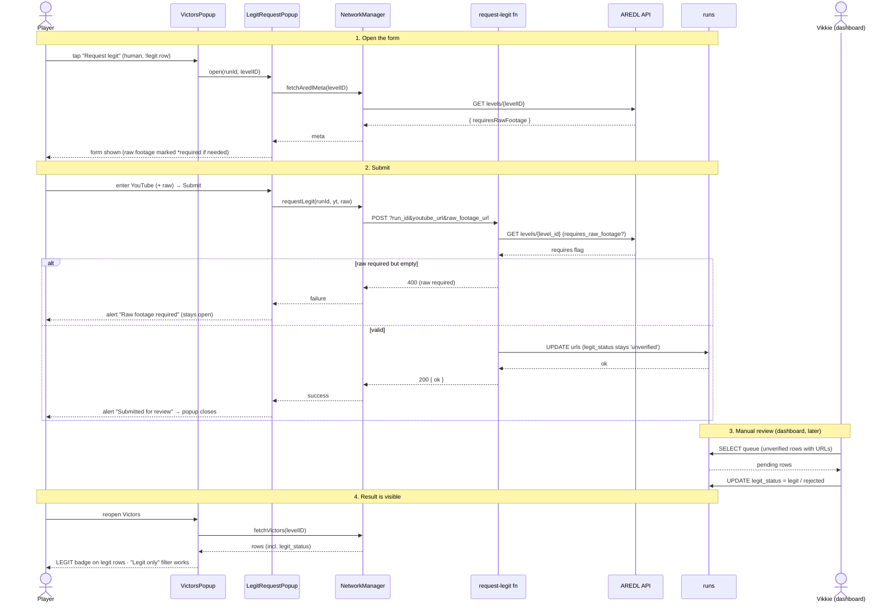

# Phase 7: Legit Verification & Moderation

> **AC:** P7-AC1…6 · **Spec:** `docs/plans/phase7-verification.spec.md` · **Design:** `docs/plans/victors-platform.design.md` §6 · **Status:** in-progress (code done; awaiting build + deploy + AC walk) · **Depends on:** P4a/P4b
> **Roadmap:** `CLAUDE.md#8-implementation-roadmap`

**This phase delivers** an in-mod **"Request legit"** flow — players attach a YouTube completion (+ Drive
raw footage when AREDL requires it) to a run; Vikkie reviews in the Supabase dashboard and flips
`legit_status`; legit runs show a **LEGIT** badge and can be filtered. **No account-ownership check** —
the footage is the proof.

---

## 1. Spec — Acceptance criteria
| AC ID | Procedure | Expected |
|-------|-----------|----------|
| P7-AC1 | On an online human run, Request legit, enter a YouTube URL, submit. | `youtube_url` (+ `raw_footage_url` if given) stored; `legit_status` stays `unverified`. |
| P7-AC2 | Request legit on a level whose AREDL `requires_raw_footage=true`, raw footage empty. | Rejected — client block + server **400**. |
| P7-AC3 | Dashboard: set `legit_status='legit'`. | Run shows a **LEGIT** badge in the Victors popup. |
| P7-AC4 | Toggle **"Legit only"**. | Only `legit` runs listed; off → all, badged. |
| P7-AC5 | A row set to `legit_status='rejected'`. | Not badged legit; hidden under the filter. |
| P7-AC6 | Bot / already-legit rows. | No **Request legit** button. |

---

## 2. Spec — What we will build

**In scope:** `request-legit` Edge Function; `NetworkManager::requestLegit` + `fetchAredlMeta`;
`LegitRequestPopup`; Victors popup LEGIT badge + "Request legit" button + "Legit only" filter; dashboard
moderation SQL (documented, no build).

**Out of scope (later):** in-mod admin review UI, submit/request rate-limiting (→ `CLAUDE.md` §9), any
account/identity proof (dropped), spectate (P5), hosting footage (always linked).

---

## 3. Spec — Functional & non-functional requirements
| ID | Requirement | Notes |
|----|-------------|-------|
| Platform (design §6) | Attach video/footage → human-reviewed `legit_status` | reserved columns already exist |
| NFR (net) | Non-blocking HTTP | worker thread + `queueInMainThread` (P4b pattern) |
| NFR (safety) | Footage **linked, never hosted**; anon key only; service_role stays server-side | |

---

## 4. Gaps & Decisions (Resolved)
| ID | Area | Decision | Status |
|----|------|----------|--------|
| D1 | Server | `request-legit` UPDATEs the run by `id` via service_role; keeps `legit_status='unverified'`. RLS still blocks direct anon writes. | ✅ |
| D2 | Server | Raw footage required **iff** AREDL `requires_raw_footage` for the run's `level_id` (fn looks it up); missing → **400**. YouTube always required. | ✅ |
| D3 | Transport | Client POSTs **URL-encoded query params** (`run_id`, `youtube_url`, `raw_footage_url`), reusing `submit`'s proven `.param()` pattern; fn reads `URL(req.url).searchParams`. (Chosen over a JSON body — matjson's build API isn't verifiable in the dev env, and `.param()` URL-encodes safely.) | ✅ |
| D4 | Moderation | **Dashboard only** (no build); queue/approve/reject SQL in §7. | ✅ |
| D5 | UI | "Request legit" shown when `source=="human" && legit_status!="legit"`. Bots never legit. | ✅ |
| D6 | UI | "Legit only" = `m_legitOnly` member + toggle; rebuild filters online rows to `legit_status=="legit"`. | ✅ |
| D7 | Identity | No account check — anyone may attach URLs to any run id; approval is manual. | ✅ |

---

## 5. Technical plan — Source-tree layout
```text
supabase/functions/request-legit/index.ts  # (new) validate + AREDL footage rule + UPDATE run URLs
src/
├── NetworkManager.hpp                      # (mod) requestLegit(runId,yt,raw,cb) + fetchAredlMeta(lvl,cb)→{found,position,requiresRawFootage}
├── LegitRequestPopup.hpp                   # (new) 2 TextInputs (YouTube always; raw *req when AREDL says) + Submit
└── VictorsPopup.hpp                        # (mod) LEGIT badge · "Request legit" btn (human,!legit) · "Legit only" toggle
docs/plans/victors-platform.design.md       # (mod) mark §6 P7 = in progress
supabase/schema.sql                         # (unchanged — columns reserved)
```

---

## 6. Technical plan — Module responsibilities
| Layer | Owns (this phase) | File(s) |
|-------|-------------------|---------|
| Server fn | validate JSON, AREDL footage rule, UPDATE URLs | `supabase/functions/request-legit/index.ts` |
| Network | `requestLegit` (JSON POST), `fetchAredlMeta` | `src/NetworkManager.hpp` |
| UI (form) | two `TextInput`s + Submit, required-footage marking | `src/LegitRequestPopup.hpp` |
| UI (list) | badge, Request-legit button, legit-only filter | `src/VictorsPopup.hpp` |

- **`request-legit` fn:** parse JSON → require `run_id` + non-empty `youtube_url`; `select level_id,source`
  (404 if missing; reject if `source=='bot'`); GET AREDL `levels/{level_id}` → if `requires_raw_footage`
  and empty `raw_footage_url` → 400; `update runs set youtube_url, raw_footage_url where id=run_id` (leave
  `legit_status`); 200 `{ok:true}`. CORS mirrors `submit`.
- **`NetworkManager`:** `requestLegit(runId, youtube, raw, cb)` worker-thread JSON `postSync`;
  `fetchAredlMeta(levelID, cb)` → `{found, position, requiresRawFootage}` (extends the P6 single-level
  fetch; P6 `fetchAredlRank` left intact). `VictorMeta.id`/`legitStatus` already parsed.
- **`LegitRequestPopup`:** `create(runId, levelID)`; on open `fetchAredlMeta` to mark raw footage
  required; validate client-side (YouTube non-empty; raw non-empty if required) → `requestLegit` →
  alert + close. Same non-template `geode::Popup` pattern.
- **`VictorsPopup::addOnlineRow`:** LEGIT marker when `legit_status=="legit"`; "Request legit" button
  when `source=="human" && legit_status!="legit"` → `LegitRequestPopup::create(v.id, m_levelID)`; an
  online-section **"Legit only"** toggle bound to `m_legitOnly` that re-`rebuild`s + filters.

---

## 7. Technical plan — Server contract + dashboard moderation
- **Call:** `POST /functions/v1/request-legit?run_id=..&youtube_url=..&raw_footage_url=..(optional)` ·
  headers `apikey` + `Authorization: Bearer <anon>` (URL-encoded query params, like `submit`; no body) ·
  resp `200 {ok}` / `400` (raw required / bad input) / `404` (run) / `5xx`.
- **Deploy (gate-3 ops):** `supabase functions deploy request-legit` (no new secret; uses auto-injected
  `SUPABASE_URL` + `SERVICE_ROLE`).
- **Review queue:**
  ```sql
  select id, level_id, victor_name, youtube_url, raw_footage_url, aredl_rank, created_at
  from runs where youtube_url is not null and legit_status='unverified' order by created_at;
  ```
- **Approve:** `update runs set legit_status='legit',    verified_by='Vikkie', verified_at=now() where id='<uuid>';`
- **Reject:**  `update runs set legit_status='rejected', verified_by='Vikkie', verified_at=now() where id='<uuid>';`

---

## 8. Rules & invariants
| Rule | Source | Enforced in |
|------|--------|-------------|
| YouTube required; raw iff AREDL requires_raw_footage | Spec §4 · P7-AC2 | `request-legit` (server) + `LegitRequestPopup` (UX) |
| Request keeps `legit_status='unverified'` | Spec §4 · P7-AC1 | `request-legit` |
| LEGIT badge only for `legit` | P7-AC3 | `VictorsPopup::addOnlineRow` |
| "legit only" filters to `legit` | P7-AC4/5 | `VictorsPopup::rebuild` |
| No Request-legit on bot/legit rows | P7-AC6 | `VictorsPopup::addOnlineRow` |
| Non-blocking HTTP | P4b pattern | `NetworkManager.hpp` |

---

## 9. Lifecycle flow

Solid `->>` = a call/action; dashed `-->>` = the response/what comes back. Every step the **Player**
initiates has a matching dashed arrow showing what they see next.



---

## 10. Convention compliance
| Rule | Status | Note |
|------|--------|------|
| `geode::Popup` non-template pattern (init/create/m_mainLayer) | Required | `LegitRequestPopup` mirrors `VictorsPopup`/`SeedingTargetsPopup` |
| Worker-thread HTTP + `queueInMainThread`; popup guarded by `Ref`+`getParent()` | Required | `NetworkManager`, popups |
| anon key only; service_role server-side; footage linked not hosted | Required | `request-legit` |

---

## 11. Tasks (checklist)
| ID | Task | File |
|----|------|------|
| T01 | `request-legit` fn (validate + AREDL rule + UPDATE) | `supabase/functions/request-legit/index.ts` |
| T02 | `requestLegit` + `fetchAredlMeta` | `src/NetworkManager.hpp` |
| T03 | `LegitRequestPopup.hpp` (form) | `src/LegitRequestPopup.hpp` |
| T04 | Victors popup: LEGIT badge + Request-legit button + Legit-only toggle | `src/VictorsPopup.hpp` |
| T05 | Doc: design §6 status; dashboard SQL note | `docs/plans/victors-platform.design.md` |
| T06 | `geode build` green (user) | — |

- [x] T01 [x] T02 [x] T03 [x] T04 [x] T05 [ ] T06 (user builds + deploys)

---

## 12. Definition of Done (gate)
**Universal gate — every phase:**
- [ ] `geode build` succeeds, no errors.
- [ ] Loads in GD `2.2081`; no crash on menu / level / popup.
- [ ] No regression — existing victor flow (list/race/upload/seed) works.
- [ ] `static_assert(sizeof(ReplayHeader)==68)` and `sizeof(FrameData)==17` pass.
- [ ] All §11 tasks ticked + §14 File List filled.
- [ ] NFR budgets unaffected.

**Phase-specific — must pass (in-game / server):**
- [ ] P7-AC1 — request stores URLs; row stays `unverified`.
- [ ] P7-AC2 — missing required raw footage → client block + server **400** (curl-verify the 400).
- [ ] P7-AC3 — dashboard `legit` → LEGIT badge shows.
- [ ] P7-AC4 — "Legit only" lists only legit runs.
- [ ] P7-AC5 — `rejected` not badged; hidden under filter.
- [ ] P7-AC6 — no Request-legit button on bot / already-legit rows.

---

## 13. Verification
- **Build:** `geode build` green (user's Windows machine). `<result>`
- **Server:** deploy `request-legit`; curl a request missing required raw footage → 400; a valid one →
  200 and the row gains the URLs (still `unverified`). `<result>`
- **In-game / dashboard** (GD 2.2081): request from an online human row; approve in dashboard; reopen →
  badge + filter behave. Testable on any level with a dummy link. `<result>`
- **Note:** no automated harness — manual in-game + curl + the struct `static_assert`s.

---

## 14. Dev Agent Record — File List
| File | Created / Modified | Role |
|------|--------------------|------|
| `supabase/functions/request-legit/index.ts` | Created | validate + AREDL footage rule + UPDATE run URLs |
| `src/NetworkManager.hpp` | Modified | `requestLegit` + `fetchAredlMeta` |
| `src/LegitRequestPopup.hpp` | Created | YouTube + raw-footage form |
| `src/VictorsPopup.hpp` | Modified | LEGIT badge + Request-legit button + Legit-only filter |
| `docs/plans/victors-platform.design.md` | Modified | §6 P7 status |

**Not in scope (later):** in-mod admin review UI, rate-limiting, account proof (dropped), spectate (P5).

---

## 15. Risks / verify-at-gate-3
- **Filter-toggle placement** — `CCMenuItemToggler`/text button in the online header vs. a popup-top
  control; finalize when wiring `VictorsPopup`.
- **`request-legit` verify_jwt** — confirm the function is callable with the anon key like `submit`
  (same gateway settings).
